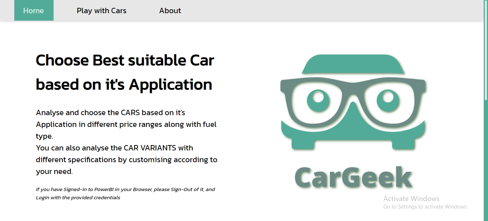
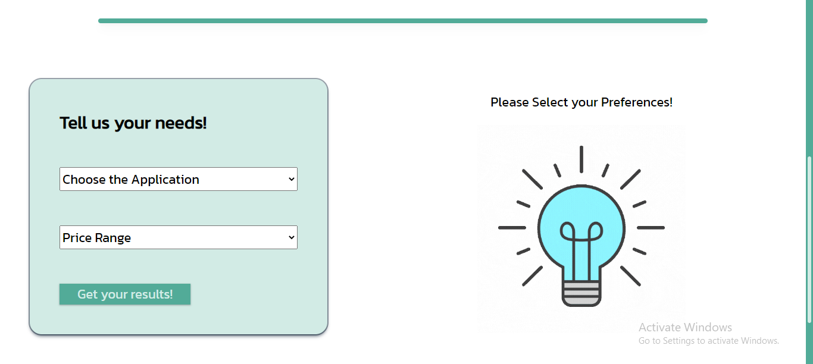
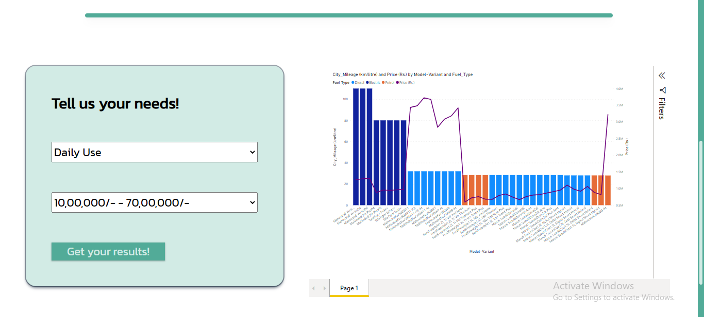
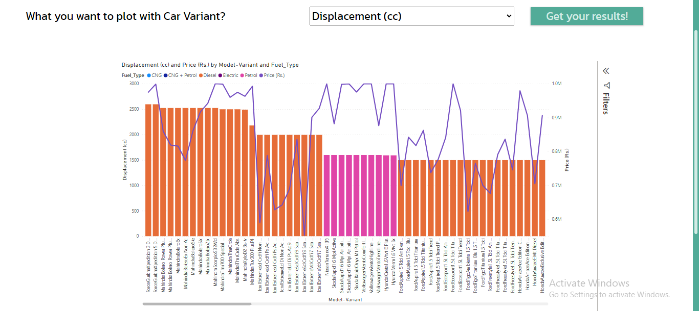
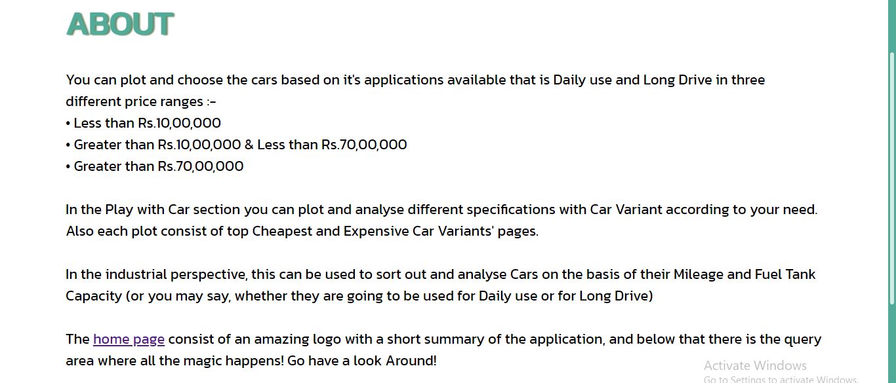

# CarGeek

A Data Analysis application developed under Microsoft Engage'22, which aims to Analyse and choose the CARS based on it's Application in different price ranges along with fuel type.

You can also analyse the CAR VARIANTS with different specifications by customising according to your need.

---

In the industrial perspective, this can be used to sort out and analyse Cars on the basis of their Mileage and Fuel Tank Capacity (or you may say, whether they are going to be used for Daily use or for Long Drive)

# Tech Stack Used

All the code is written in raw HTML, CSS, and JavaScript

The basic idea of the app is to get the data which user wants to see, then import it directly form PowerBI, for the user to see

# Dataset Used

I have used the dataset readily provided on the Acehacker Website with the challenge, [here](https://acehacker.com/microsoft/engage2022/cars_engage_2022.csv) is the link to it.

As a first step, I've cleaned the dataset using [Jupyter Notebook](https://github.com/aastha-chauhan-gits/CarGeek/blob/master/notebook.ipynb) and some mannual work using Microsoft Excel

Now the dataset is imported in Microsoft Power BI, on which graphs are made as per the data specified, and then they are embedded in my website

## Screenshots of the App

# Deployment

The app is deployed on GitHub Pages, you can see it here : [DEPLOYMENT](https://aastha-chauhan-gits.github.io/CarGeek/)